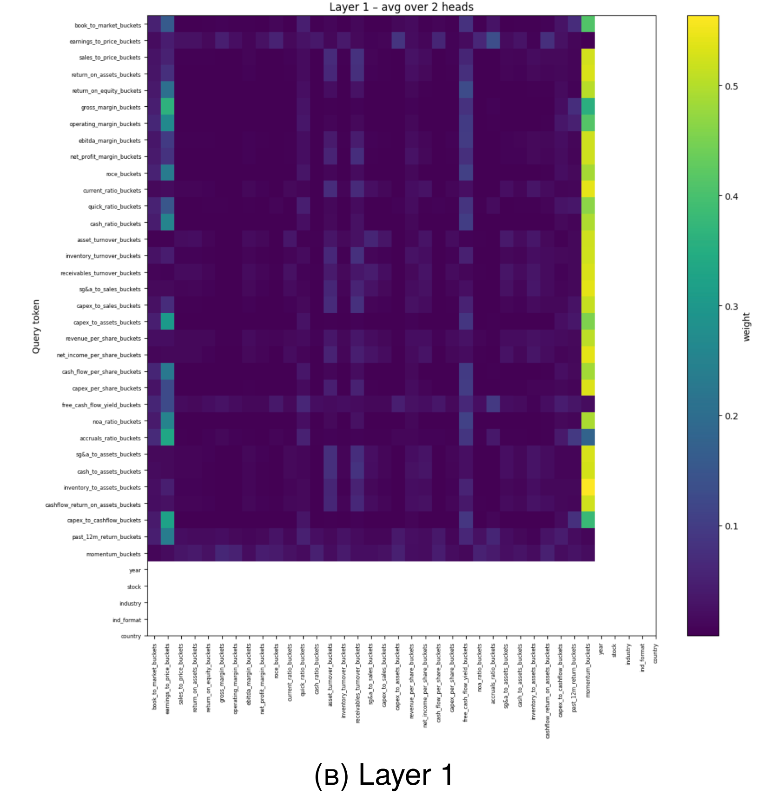
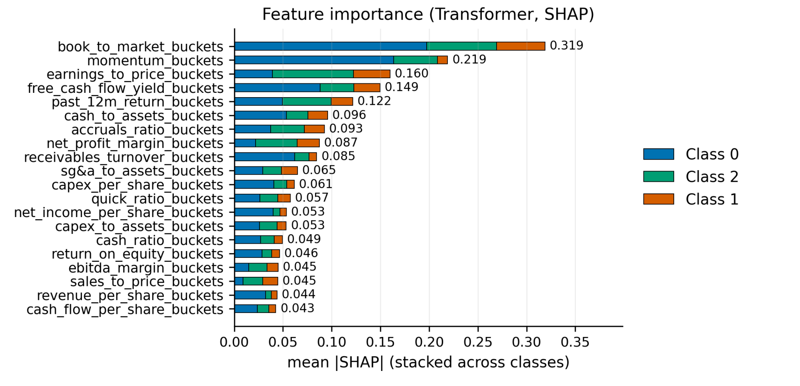

# Transformer-Based Financial Return Prediction in Emerging Markets

> **A deep learning project exploring whether attention based mechanisms can identify interpretable alpha signals in volatile emerging market equities.**

[](https://www.python.org/)
[](https://pytorch.org/)
[]()

---

## Project Overview

This project applies a **Transformer Encoder architecture** to predict stock returns in emerging markets using bucketed financial ratios.
Unlike traditional "black box" deep learning models, this project focuses heavily on **interpretability**—using attention mechanisms to uncover exactly *which* financial signals drive predictions.

The model was benchmarked against **XGBoost** and demonstrated competitive performance while offering superior transparency through **Attention Rollout** and **Entropy-based importance analysis**.

---

## Motivation

Emerging markets are notoriously volatile and inefficient compared to developed markets. This project addresses two key problems in quantitative finance:

1. **Non-Linear Patterns**
   Captures complex, non-linear relationships in financial ratios that linear models miss.

2. **Trust & Transparency**
   Addresses the “black box” problem by mapping predictions back to economic drivers (e.g. Momentum, Book-to-Market), making the model usable and interpretable for portfolio managers.

---

## Approach

* **Data Source**
  Compustat Global – Emerging Markets (2006–2025).
  *Raw data is not provided due to licensing and privacy restrictions.*

* **Preprocessing**
  Quantile-based discretization (bucketing) of financial ratios to handle outliers and noise.

* **Model Architecture**
  **Custom PyTorch Transformer (Encoder-only)**

  * 4 layers
  * 2 attention heads
  * Embedding dimension: 64

* **Optimisation**
  Hyperparameter tuning via **Optuna** using a **TPE sampler**, run on the SCRUM GPU cluster.

* **Validation**
  Expanding-window evaluation to realistically simulate live trading conditions.

---

## Results

The Transformer achieved performance comparable to the industry-standard XGBoost baseline while offering significantly stronger interpretability.

| Metric                        | XGBoost (Baseline) | **Transformer (My Model)**          |
| ----------------------------- | ------------------ | ----------------------------------- |
| **Accuracy (Test)**           | 42.1%              | **40.0%** (Competitive)             |
| **Class 2 F1 (High Returns)** | 0.32               | **0.41** (Better Recall)            |
| **Interpretability**          | SHAP only          | **Attention Maps + Rollout + SHAP** |

*Metrics correspond to results reported in the dissertation.*

---

## Interpretability & Insights

Using **Attention Matrix Extraction** and **SHAP**, the model consistently identified economically meaningful signals across different market regimes:

* **Momentum**
  Identified as a global hub feature via attention rollout.

* **Value Signals**
  Book-to-Market and Earnings-to-Price were consistently top-ranked drivers.

### Visual Interpretability


*Layer-wise attention heatmaps showing internal focus on Momentum and Book-to-Market signals.*


*SHAP summary plot quantifying feature contributions to final predictions.*

**Key Insight**

Attention and SHAP provide **complementary explanations**:

* **Attention** reveals how information flows internally through the network.
* **SHAP** identifies which features ultimately drive the output.

The divergence between these views is a strength rather than a flaw, reducing blind spots that arise when relying on a single interpretability method.

---

## Tech Stack

* **Core:** Python, PyTorch, NumPy, Pandas
* **ML / Stats:** Scikit-learn, XGBoost, Optuna
* **Visualisation:** Matplotlib, Seaborn, SHAP
* **Dev Tools:** Git, VS Code, Jupyter Lab

---

## How to Run

### Clone the repository
You will need the **Compustat Emerging Markets Data File** which is **not** provided. The results however can be observed through the notebook or the dissertation.

```bash
git clone https://github.com/hs5450/ml-emerging_markets-dissertation.git
cd ml-emerging_markets-dissertation
jupyter lab
```

